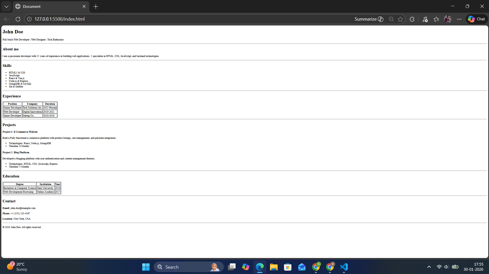

# HTML Resume Page

This project is a simple resume web page created using basic HTML.

## Project Description
The goal of this project is to design a resume page using HTML elements such as headings, paragraphs, lists, and tables.

## Setup Instructions
1. Download or clone the repository
2. Open the `index.html` file in any web browser

## Usage
This project can be used as a basic template for creating a personal resume and for practicing HTML fundamentals.

## Demo
### Screenshot

## Technologies Used
- HTML5

## Author
Rahul Sharma
